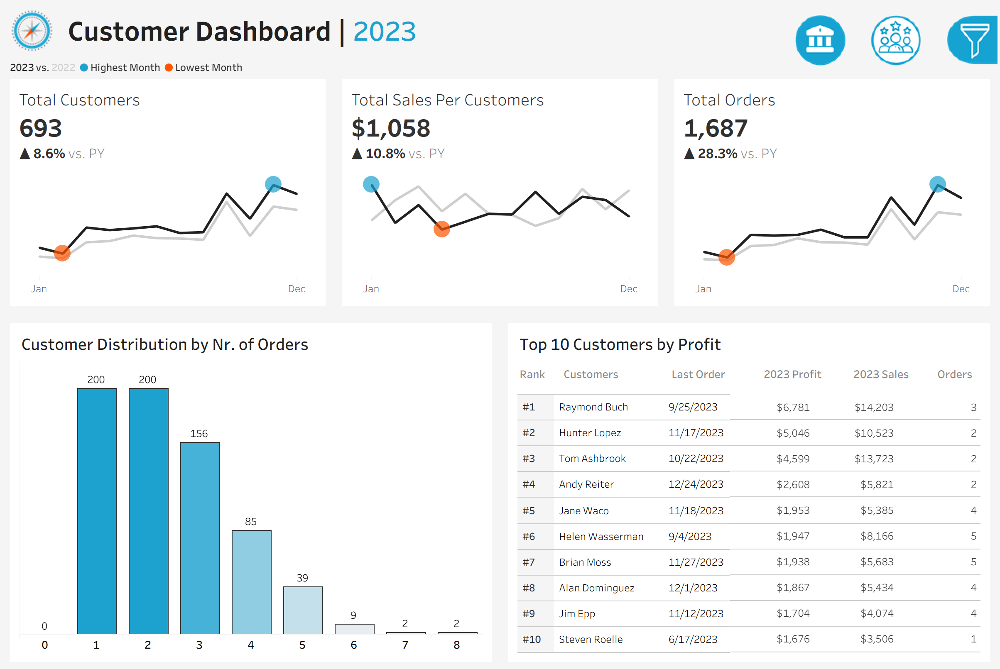
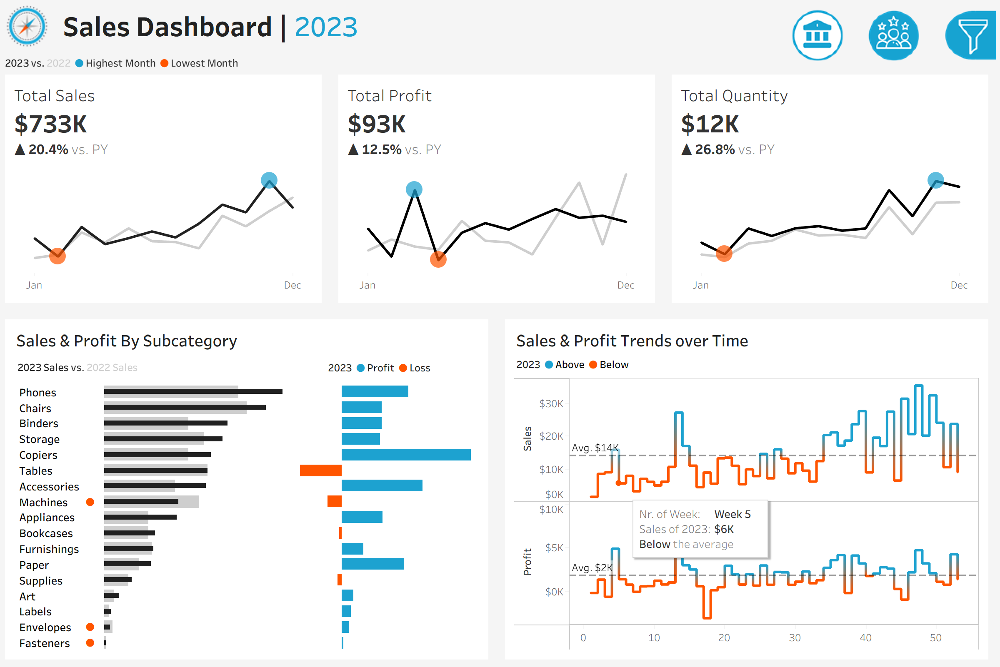

# E-commerce Customer & Sales Dashboard (Tableau)

This Tableau project visualizes key metrics for an e-commerce business:  
- Customer growth  
- Sales per customer  
- Orders and profitability  
- Top customers and category-wise sales  

## Tools
- Tableau
- Excel

## Preview

## Files
- `Ecommerce_Dashboard.twbx` → Tableau packaged workbook  
- `data_sample.xlsx` → Sample dataset  
